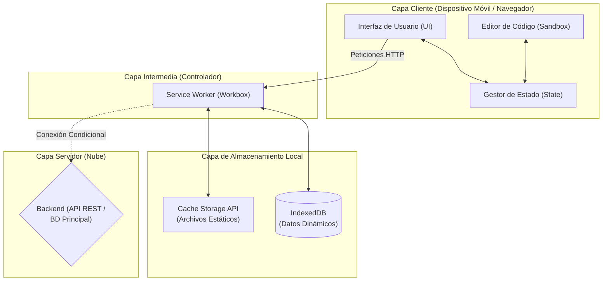
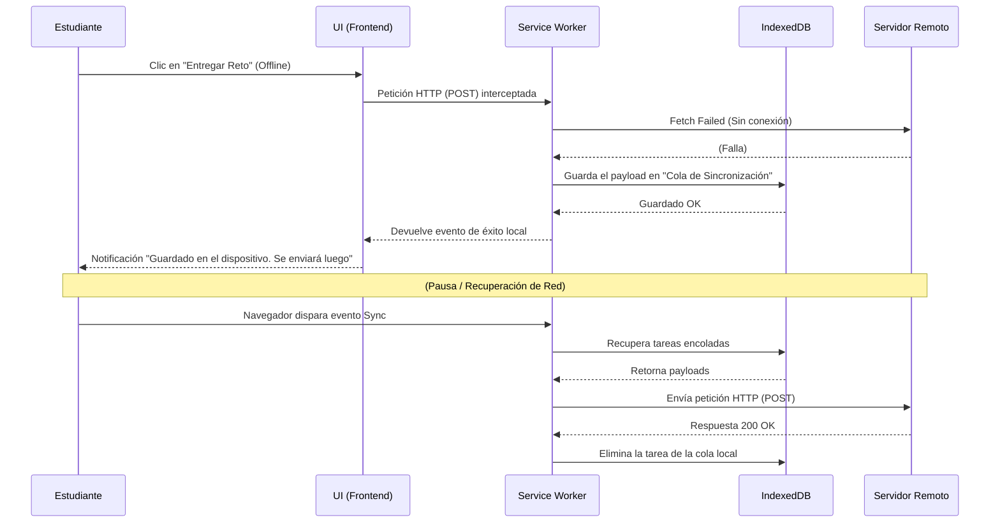
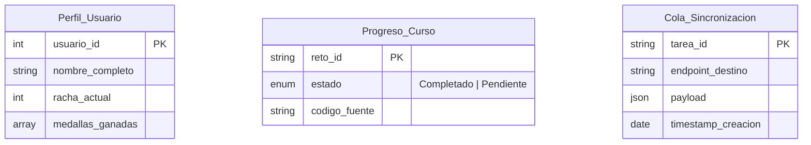

# Documentación de Arquitectura y Datos

A continuación se presentan los diagramas de arquitectura, flujo de sincronización asíncrona y modelo físico de datos local para la PWA de Espacio Educa.

### Figura 1. Arquitectura de Componentes del Sistema PWA

Este diagrama de nivel de contenedores (C4) muestra cómo el Cliente se comunica con la Nube a través de la capa intermedia del Service Worker y las bases de datos locales.

### Figura 2. Flujo de Sincronización Asíncrona (Background Sync)

Diagrama de Secuencia que ilustra el proceso de entrega de un reto cuando no hay conexión a internet y su posterior sincronización.

### Figura 3. Modelo Físico de Datos Local en IndexedDB

Diagrama Entidad-Relación de las principales tablas (Object Stores) guardadas localmente.

