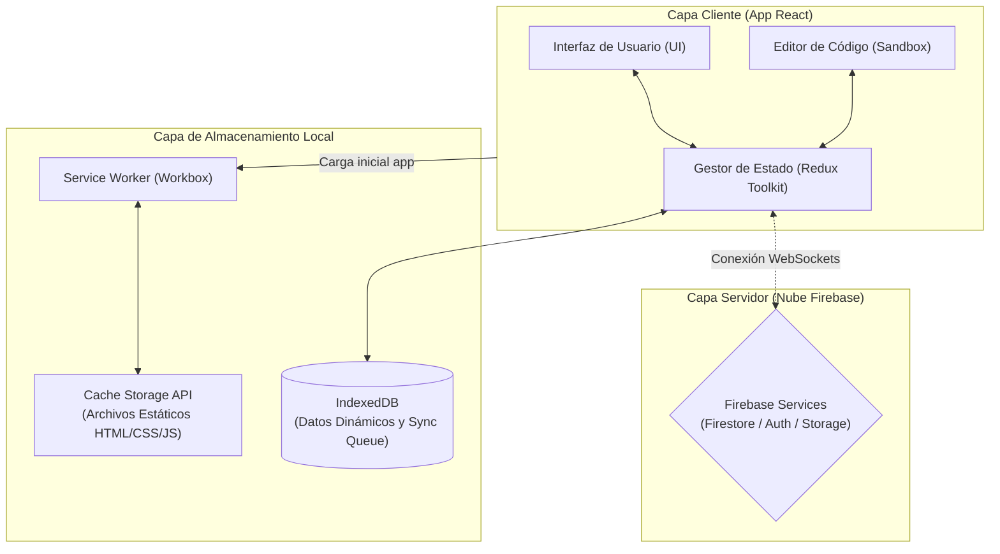
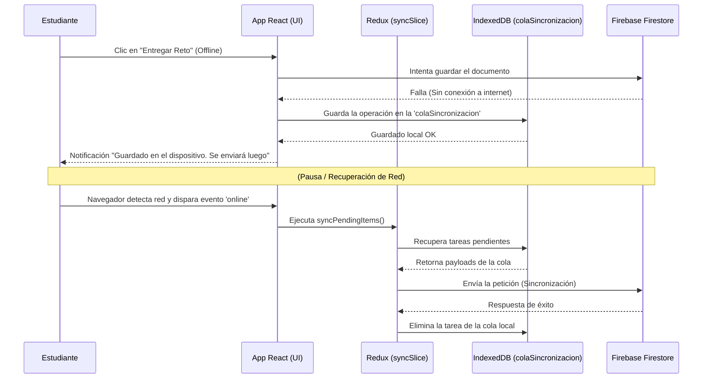
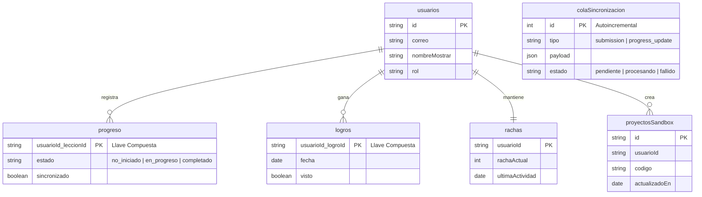

# Documentación de Arquitectura y Datos

A continuación se presentan los diagramas de arquitectura, flujo de sincronización asíncrona y modelo físico de datos local para la PWA de Espacio Educa.

### Figura 1. Arquitectura de Componentes del Sistema PWA

Este diagrama de nivel de contenedores (C4) muestra cómo el Cliente se comunica con la Nube. Destaca la separación entre archivos estáticos manejados por el Service Worker y los datos dinámicos manejados directamente por React/Redux hacia Firebase.

### Figura 2. Flujo de Sincronización Asíncrona (Offline-First)

Diagrama de Secuencia que ilustra el proceso de entrega de un reto cuando no hay conexión a internet y su posterior sincronización controlada por Redux y la cola nativa.

### Figura 3. Modelo Físico de Datos Local en IndexedDB

Diagrama Entidad-Relación de los principales Object Stores (tablas) guardados localmente para permitir el funcionamiento sin conexión, correspondientes al esquema real de `schema.js`.

