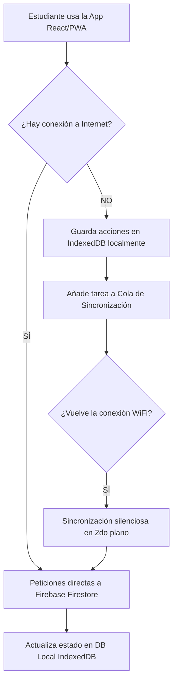

# Arquitectura y Base de Datos - Espacio Educa

La aplicación utiliza una arquitectura **Offline-First** híbrida. Consiste en dos bases de datos sincronizadas para permitir que los estudiantes puedan usar la plataforma sin interrupciones, incluso si el internet del colegio falla.

## 1. Diagrama de Flujo Offline-First

## 2. Modelos de Datos

### Firestore (En la Nube / Firebase)
Almacena la verdad absoluta y sincroniza los datos entre todos los dispositivos y usuarios.

* **`perfiles_usuarios`**: UID de Firebase, correo, nombreMostrar, rol (estudiante/profesor/admin), xp, colegio, salon, preferencias.
* **`modulos`**: nivel (básico/avanzado), orden (número), título, descripción, isPublished.
* **`lecciones`**: ID, moduloId (relación con módulos), título, bloques (array de contenido y popcodes).
* **`entregas`**: estudianteId, leccionId, código entregado, calificación, feedback, entregadoEn.

### IndexedDB (Local / Navegador)
Motor: `idb` (espacio-educa-db-v2). Propósito: Permitir el uso de la aplicación offline y servir como caché ultra rápido.

* **`usuarios`**: Sesión local guardada para acceder sin WiFi.
* **`modulos`**: Caché del pensum de estudios.
* **`lecciones`**: Caché de la teoría y ejercicios de cada clase.
* **`progreso`**: (Llave compuesta: `usuarioId` + `leccionId`) Rastrea qué ha completado el alumno.
* **`logros`**: Caché de medallas desbloqueadas por el alumno.
* **`retos`**: Ejercicios adicionales temporales.
* **`rachas`**: Días consecutivos que el alumno entra a la app.
* **`proyectosSandbox`**: Código libre que el estudiante guarda en su computadora sin subirlo a la nube.
* **`colaSincronizacion`**: El corazón del offline-first. Almacena las tareas pendientes (como entregar una lección) que no se enviaron por falta de internet.
