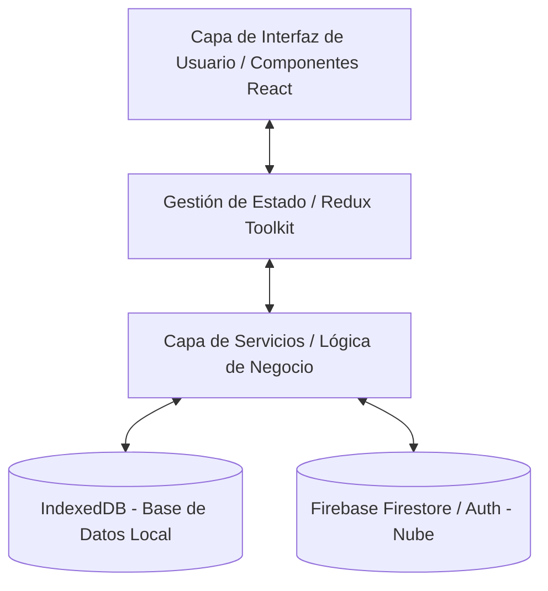
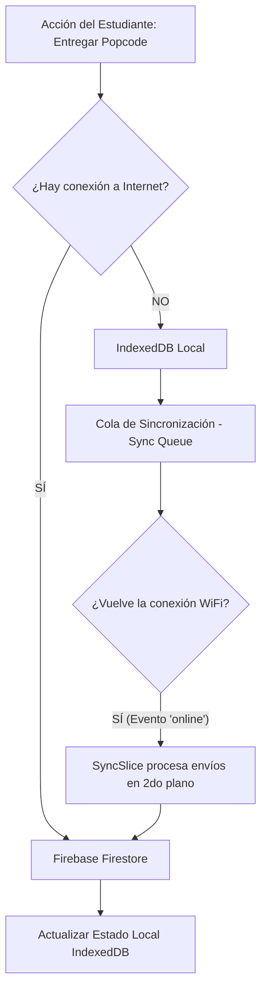
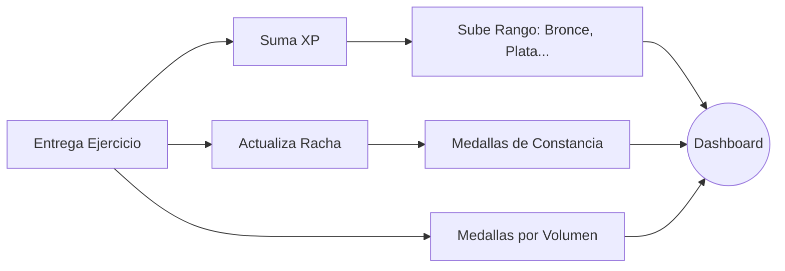

# Arquitectura General - Espacio Educa

Este documento detalla la arquitectura técnica, los flujos de datos y los modelos de base de datos de la plataforma educativa "Espacio Educa".

## 1. Arquitectura del Frontend (Aplicación Web Progresiva - PWA)

La aplicación está construida como una PWA (Progressive Web App) con las siguientes tecnologías clave:
- **Framework Core:** React.js optimizado con Vite.
- **Enrutamiento:** React Router DOM.
- **Estilos e Interfaz:** TailwindCSS (para diseño responsivo y temas claro/oscuro).
- **Gestión de Estado:** Redux Toolkit.
- **Persistencia Local:** IndexedDB (librería `idb`) para garantizar el funcionamiento offline.

### Diagrama de Capas de la Aplicación

## 2. Gestión de Estado Global (Redux Toolkit)

La plataforma distribuye su estado en múltiples "slices" especializados para mantener el código modular:
- **`authSlice`**: Maneja la sesión del usuario, verificando si está online u offline.
- **`gamificationSlice`**: Calcula y distribuye puntos de experiencia (XP), maneja el progreso de las rachas diarias y evalúa el otorgamiento de medallas (badges).
- **`progressSlice`**: Mantiene un registro en memoria de las lecciones completadas y el avance de los módulos.
- **`syncSlice`**: El motor del modo Offline. Observa la cola de sincronización de IndexedDB y procesa los envíos cuando se detecta conexión a internet.

## 3. Arquitectura Offline-First y Sincronización

El mayor reto técnico es permitir a los estudiantes estudiar y entregar actividades sin depender de una conexión estable.

### Diagrama de Flujo Offline-First

## 4. Esquema de Bases de Datos

El sistema utiliza dos bases de datos que funcionan en espejo, asegurando una transición invisible entre online y offline.

### 4.1. Firestore (Base de Datos Central en la Nube)
Colecciones NoSQL alojadas en Firebase. Es la "fuente de la verdad".

* **`perfiles_usuarios`**:
  - `id`: UID (Llave Primaria)
  - `correo`, `nombreMostrar`, `rol` (estudiante/profesor/admin)
  - `colegio`, `salon`
  - `xp`, `preferencias`
* **`modulos`**:
  - `id`: String
  - `nivel`: basico / avanzado
  - `orden`: Integer (para ordenar el pensum)
  - `titulo`, `descripcion`, `isPublished`
* **`lecciones`**:
  - `id`: String
  - `moduloId`: Foreign Key -> modulos
  - `orden`, `titulo`
  - `bloques`: Array de objetos (teoría, popcodes/ejercicios, recursos)
* **`entregas`**:
  - `id`: Auto-generado
  - `estudianteId`: Foreign Key -> perfiles_usuarios
  - `leccionId`: Foreign Key -> lecciones
  - `codigo`: El código HTML/JS escrito por el alumno
  - `calificacion`: Nota asignada (0-20)
  - `feedback`: Comentarios del profesor
  - `entregadoEn`: Timestamp

### 4.2. IndexedDB (Base de Datos Local Offline)
Motor nativo del navegador, estructurado mediante Object Stores. Nombre de la DB: `espacio-educa-db-v2`.

* **`usuarios`**: Almacena los tokens y datos básicos para permitir iniciar sesión en modo avión.
* **`modulos` y `lecciones`**: El pensum académico completo descargado localmente como caché de lectura.
* **`progreso`**: Llave compuesta `[usuarioId, leccionId]`. Estado: `no_iniciado`, `en_progreso`, `completado`.
* **`logros`**: Caché de las medallas ganadas para visualizarlas en el dashboard sin consumo de datos.
* **`rachas`**: Conteo de días consecutivos de actividad.
* **`proyectosSandbox`**: Espacio personal donde el estudiante guarda código. Se guarda EXCLUSIVAMENTE en local, garantizando privacidad y cero latencia.
* **`colaSincronizacion` (Sync Queue)**: Estructura crítica. Guarda operaciones CRUD pausadas.
  - Campos: `id`, `tipoAccion`, `payload` (datos), `estado` (pendiente, procesando, fallido), `intentos`.

## 5. Motor de Gamificación

El sistema de gamificación motiva al estudiante combinando Firestore con reglas lógicas de React.

1. **Rachas (Streaks)**: Validado por el modelo local `StreakModel`. Solo se suma un día si la actividad es en una fecha distinta. Para proteger las cuotas de red, se sube a Firebase únicamente un (1) write al día.
2. **Sistema de Rangos**: Basado en umbrales de XP predefinidos (Bronce > 500 XP, Plata > 1500 XP, Oro > 3000 XP).
3. **Medallas (Logros/Badges)**: El catálogo oficial (`ACHIEVEMENT_CATALOG`) intercepta el número total de entregas y las notas máximas de cada alumno. Optimizado para hacer solo *1 read* global contando los documentos offline o en el servidor.
